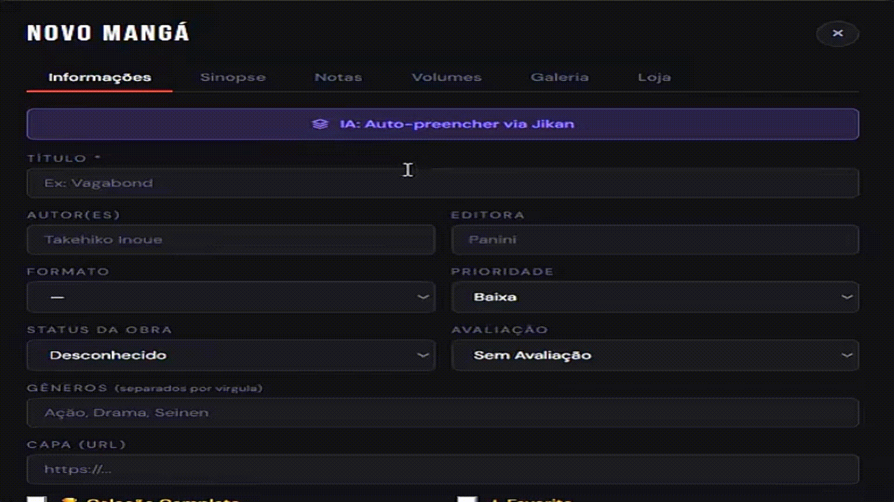
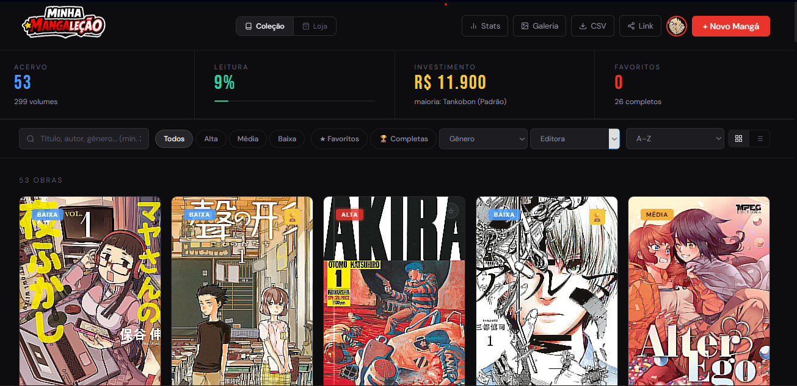
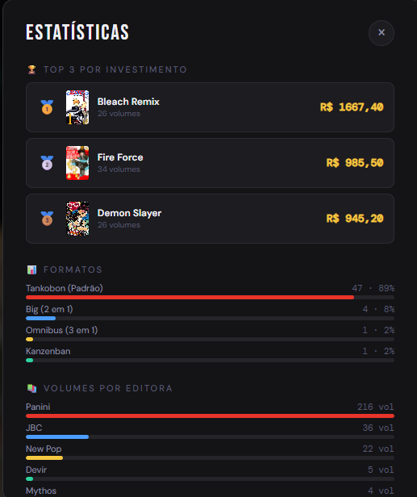

# 📚 Minha Mangaleção

### Controle absoluto sobre sua coleção de mangás

---

O **Minha Mangaleção** é um Progressive Web App (PWA) de arquitetura serverless projetado para oferecer controle absoluto sobre acervos de mangás. Construído de colecionador para colecionador, o sistema permite gerenciar volumes, acompanhar investimentos financeiros e organizar a estante virtual de forma rápida, segura e sem depender de frameworks pesados.

🚀 **Experimente agora:** [minha-mangalecao.web.app](https://minha-mangalecao.web.app/)

---

## 🚀 Funcionalidades Principais

* **Catalogação Inteligente & Auto-preenchimento:** Integração direta com a **Jikan API** para buscar dados da obra, capas e gêneros automaticamente, dispensando a digitação manual.
* **Tradução de Sinopses Multi-Motor:** Ferramenta embutida para traduzir sinopses do inglês para o PT-BR, com fallback dinâmico e suporte nativo às APIs do **Google Gemini** (1.5 / 2.0 Flash), **Anthropic Claude** ou ao motor open-source **LibreTranslate**.
* **Controle Financeiro e Estatísticas:** Painel dinâmico que calcula o total investido, o progresso de leitura, a editora predominante e gera gráficos SVG nativos da evolução do acervo e histórico de preços de cada obra.
* **Modo Loja & Vitrine Pública:** Geração de um link público (`?user=UID`) para compartilhamento da coleção (somente leitura). O "Modo Loja" permite listar volumes avulsos ou coleções completas à venda, gerando mensagens automatizadas com os preços e condições diretamente para o WhatsApp do vendedor.
* **Importação e Exportação (CSV):** Controle total dos dados pelo usuário, com suporte para exportar a coleção inteira ou importar listas em massa via arquivos CSV.
* **Design Adaptativo (Mobile-First):** Layout flexível que atua como um aplicativo nativo em telas menores (< 700px), adotando navegação inferior (Bottom Nav), Floating Action Buttons (FAB) e visualizações modais otimizadas.
* **Galeria de Imagens:** Espaço dedicado para upload de fotos reais da coleção do usuário, com visualização em formato Lightbox com suporte a zoom.

---

## 🖼️ Interface e Demonstração

### Auto-preenchimento Inteligente (Integração Jikan API)
Abaixo, a demonstração do sistema buscando metadados, capas e traduzindo sinopses automaticamente em poucos segundos:

---

### Visão Geral do Acervo (Dashboard)
Painel principal exibindo as métricas de investimento, progresso de leitura e o grid de obras cadastradas.

---

### Motor de Estatísticas Avançadas
Cálculo dinâmico de valorização, distribuição de formatos e ranking de editoras focado em colecionadores físicos.

---

### Landing Page Comercial
Página de captura e apresentação do sistema, focada na conversão de novos usuários.

---

## 🛠️ Stack Tecnológica

O projeto foi construído priorizando performance, tempo de carregamento e funcionamento offline, utilizando uma stack enxuta e livre de frameworks front-end:

* **Frontend:** HTML5, CSS3, Vanilla JavaScript (ES6 Modules).
* **Backend & Banco de Dados:** Firebase App Compat (Firestore para dados NoSQL estruturados, Firebase Auth para autenticação via Google/Email).
* **Processamento de Dados:** [PapaParse](https://www.papaparse.com/) para parsing ultrarrápido de arquivos CSV.
* **Segurança:** [DOMPurify](https://github.com/cure53/DOMPurify) para sanitização rigorosa de inputs e prevenção de ataques XSS.
* **Integrações Externas:** Jikan API (MyAnimeList), Gemini API, Claude API.

---

## 📂 Arquitetura do Sistema

O código-fonte segue um padrão modular rigoroso, separando regras de negócio, chamadas de API e renderização de interface:

* `/services/dbService.js`: Camada de abstração do Firestore. Expõe apenas métodos puros (CRUD e cálculos matemáticos de investimento/leitura) sem conhecimento do DOM.
* `/services/apiService.js`: Gerenciador de requisições externas (Jikan API, chamadas aos LLMs com *retry exponencial* e processamento de CSV).
* `/ui/render.js` e `/ui/components.js`: Componentização em Vanilla JS. Lida com a montagem dinâmica de cards, tabelas, modais, sanitização de dados e *Fuzzy Search* para o motor de busca interno.
* `charts.js` e `charts.css`: Motor autoral de renderização de gráficos em SVG puro, eliminando a necessidade de bibliotecas pesadas (como Chart.js) para exibir a evolução histórica de preços.
* `mobile.js` e `mobile.css`: Tratamento isolado do estado de modais (`_modalDepth`) e roteamento visual exclusivo para a versão de dispositivos móveis.
* `main.js`: O orquestrador central do ciclo de vida da aplicação e observador de estado de autenticação.

---

## 🧠 Roadmap

- [ ] Scanner ISBN por câmera
- [ ] Recomendações por IA
- [ ] Sistema social de colecionadores
- [ ] Marketplace interno
- [ ] Comparador de preços entre lojas

---

## 🔒 Segurança e Privacidade

* **Isolamento de Dados:** Cada usuário possui sua própria subcoleção restrita no Firestore. Nenhuma informação é compartilhada com terceiros.
* **Exclusão em Cascata:** Suporte total à LGPD. O usuário pode deletar sua conta permanentemente com um clique, acionando uma rotina de exclusão em lotes (batch) que varre e apaga todos os documentos associados ao seu UID.

---

## ✉️ Contato

Desenvolvido por Matheus Lima — [LinkedIn](https://www.linkedin.com/in/matheuslim/) | GitHub: [@Math-Lima0](https://github.com/Math-Lima0)
